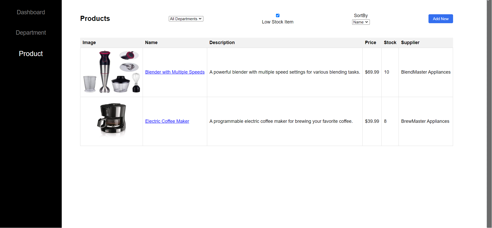
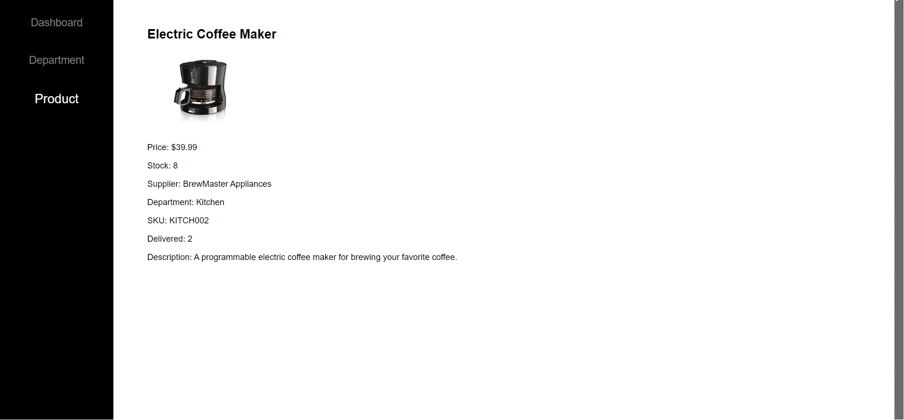

## App Features:

Key features of this app includes:

- Inventory Dashboard: This dashboard provides an overview of inventory levels, including the total stock count, low-stock items, and items delivered till now. These cards are not clickable, they just show the data.

- Total Stock is total quantity of all the items that exist in the inventory.
Total Delivered is the total number of items delivered till now from the entire inventory.
Low stock items have a quantity less than or equal to 10.
<!--
   -->

- Departments Page: In this page show different inventory departments within the business. User can view each department's inventory by clicking on the cards and navigating to that specific product lists.

  The different departments are:

        Kitchen
        Clothing
        Toys
        Departments

<!--  -->

- Product List Page: This page displays a list of products within a chosen department. User can filter and sort products based on different attributes.
<!--
 -->

- Filter by department using dropdown - All departments, kitchen, clothing, toys

- Filter by low stock - Use checkbox to filter items for low stock. Low stock items have a quantity less than or equal to 10.
  <!-- 

     -->
  

- Sort by Name, Price and Stock using dropdown On selecting from the dropdown, sort the items in ascending order.

- Product Management: Allows user to add new products to the inventory by clicking on the ‘New’ button on product list page. Allow to add attributes like department, product name, description, price, stock (quantity), SKU (stocking unit), supplier name, items delivered (keep 0 when adding new product) and item image url.
  <!--  -->
  

Newly added item should persist in the product listing on page reload.

- Detailed Product Page: Clicking on a product from the list navigates user to a detailed product page. This page provides extensive information about the selected product, including its attributes, current stock level, and supplier name, etc.
<!--
- 
  -->

